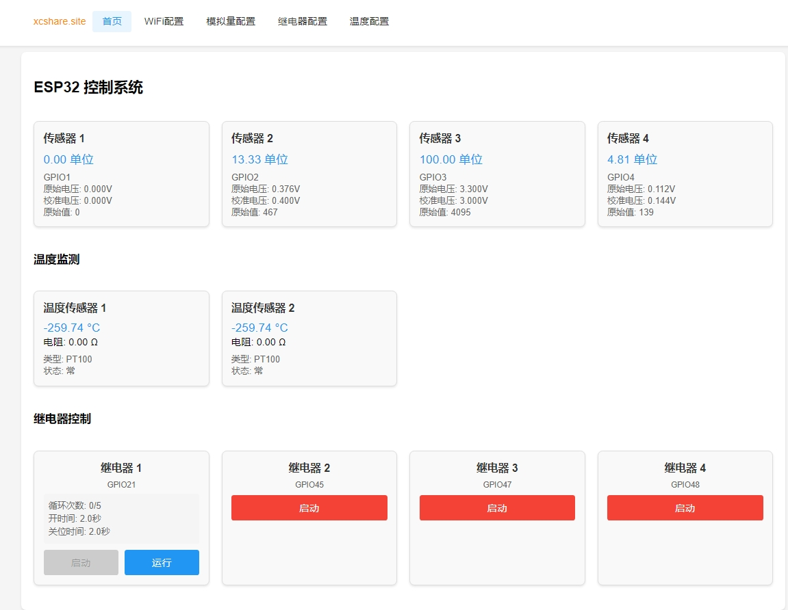
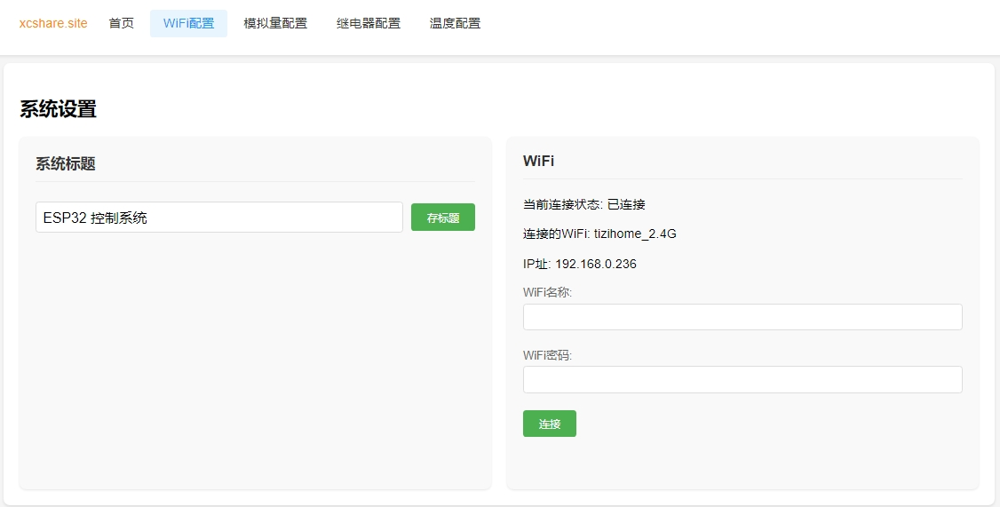
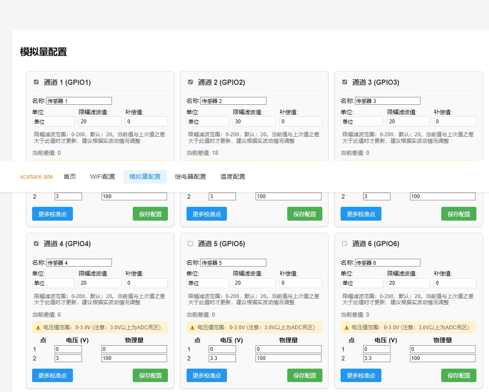
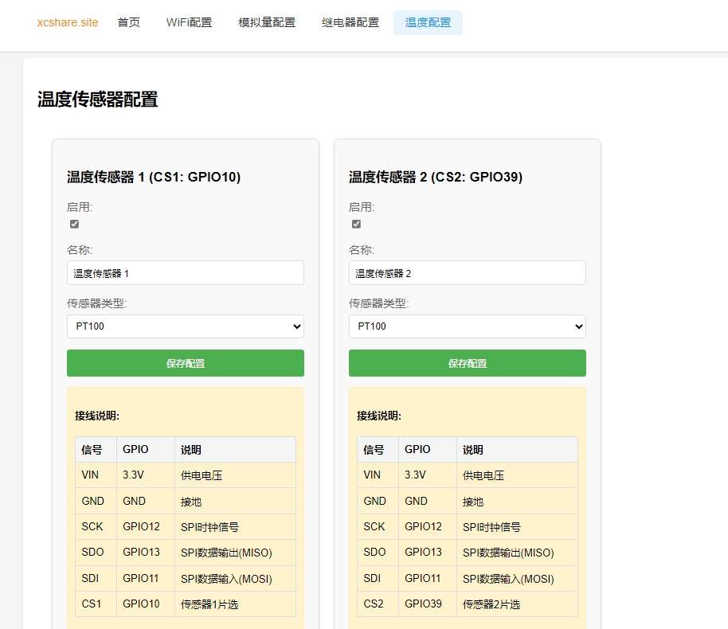
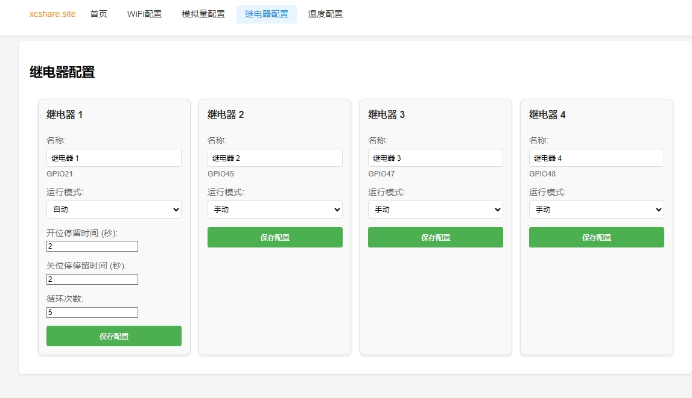
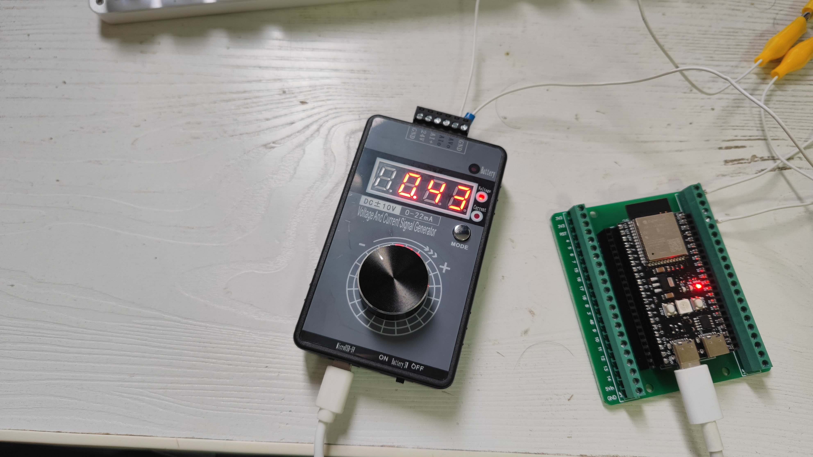

# 概述

利用ESP32-S3 的局域网功能，

具体功能如下：

1.包含了12路模拟量的物理量转换;

2.2路温度（PT100、PT1000）的测量;

3.4路继电器的手动及自动控制;

4. 局域网配置有AP热点和wifi一键配网功能，配网成功后，自动显示IP;

# 详细说明

   采用ESP32-S3 ,我用的是ESP32-S3-DevKitC-1 有44个针脚，理论上，只要是ESP32 都可以的，但要看你具体的GPIO是否有那么多个模拟量采集通道。

   上电后，搜索网络AP热点

   AP_SSID = "YourAPSSID"; 

   AP_PASS = "12345678"; 

    输入密码后，链接成功后，就可以登陆了，AP网络的IP地址是 192.168.4.1

   剩下的就很简单了，用浏览器打开上面的IP地址后，查看和设置。

### 首页

   

### 系统设置

   

### 模拟量配置页面

   

### 温度传感器配置页面

   

### 继电器配置页面

   

其中logo文字 [xcshare.site](xcshare.site) 可以在html.h文件中修改为你想要的logo.

## 数据的滤波

   经过多次对比，发现采用幅值法有比较好的体感，由于ADC干扰电压，采样值的波动和偏离， 幅值法很简单， 如果ADC数值调动没有超过设定值，就保持不变，一秒钟采集10次的差值，会显示在配置页面，供参考。

## 数据的校准

   经过对比，发现单片机转换后的电压和实测值存在较大的偏差，不但有偏差，还存在差不多0.03V的调动，并且3.0-3.3V还存在盲区，这让人真头疼，我采用了信号发生器进行了简单的数值查找法，只利用0-3.0V的范围，以下是我校准的过程

   

   实测电压（V） -> 网页显示电压（V）
0	->	0；
0.1	->	0.065；
0.2	->	0.165；
0.3	->	0.265；
0.4	->	0.365；
0.5	->	0.465；
0.6	->	0.565；
0.7	->	0.665；
0.8	->	0.765；
0.9	->	0.865；
1	->	0.932；
1.1	->	1.032；
1.2	->	1.132；
1.3	->	1.232；
1.4	->	1.332；
1.5	->	1.432； 
1.6	->	1.532；
1.7	->	1.632；
1.8	->	1.732；
1.9	->	1.832；
2	->	1.932；
2.1	->	2.032；
2.2	->	2.132；
2.3	->	2.232；
2.4	->	2.332；
2.5	->	2.432；
2.6	->	2.532；
2.7	->	2.665；
2.8	->	2.8；
2.9	->	2.932；
3	->	3.1；

   很明显，分辨率在0.1V ，当ADC实测值在右侧数值的+/-0.02V 范围内，就按照左侧数数值修订。

   当ADC实测值不在上面的范围，就比例对应在相邻值之间。

   我并没有进一步细化分辨率。由于ADC的值存在波动，我觉得这样做的意义不大，且耗费较多的精力。

## 注意事项

   ESP32 能接受的电压范围只能是0-3V,  至于传感器的信号电压：0-5V、0-10V 、4-20mA 都需要电压转换，建议采用市场上成熟的转换模块，如果没有，可以考虑用电阻分压的原理进行转换，具体模拟量配置页面中有说明。

# 结论

   目前看来，单片机来做工业传感器的采样，并不是很好，只能用在控制精度和稳定性不高的场合，玩玩可以，但真正要用到传感器的数据采集和显示，我认为PLC是比较专业的。

   
